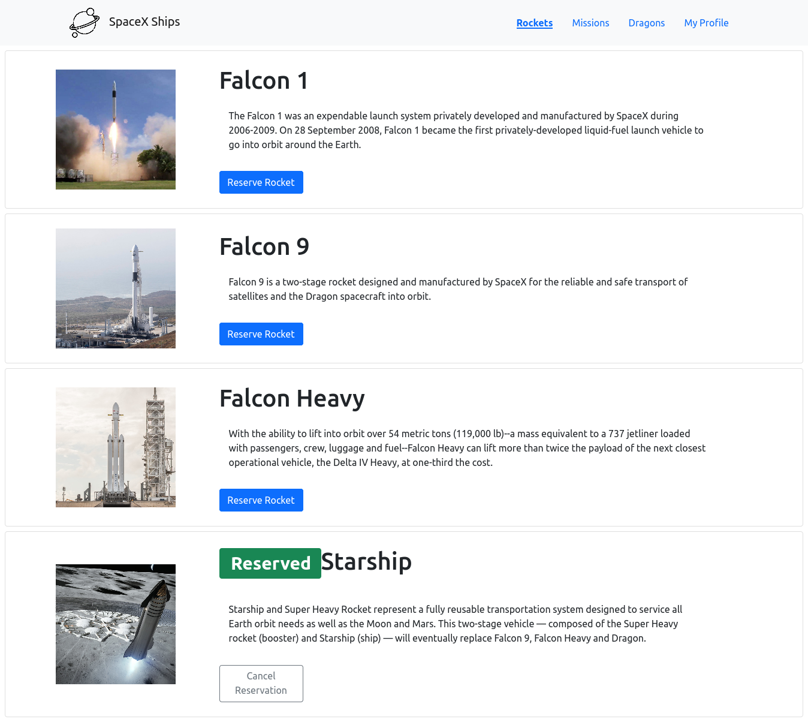
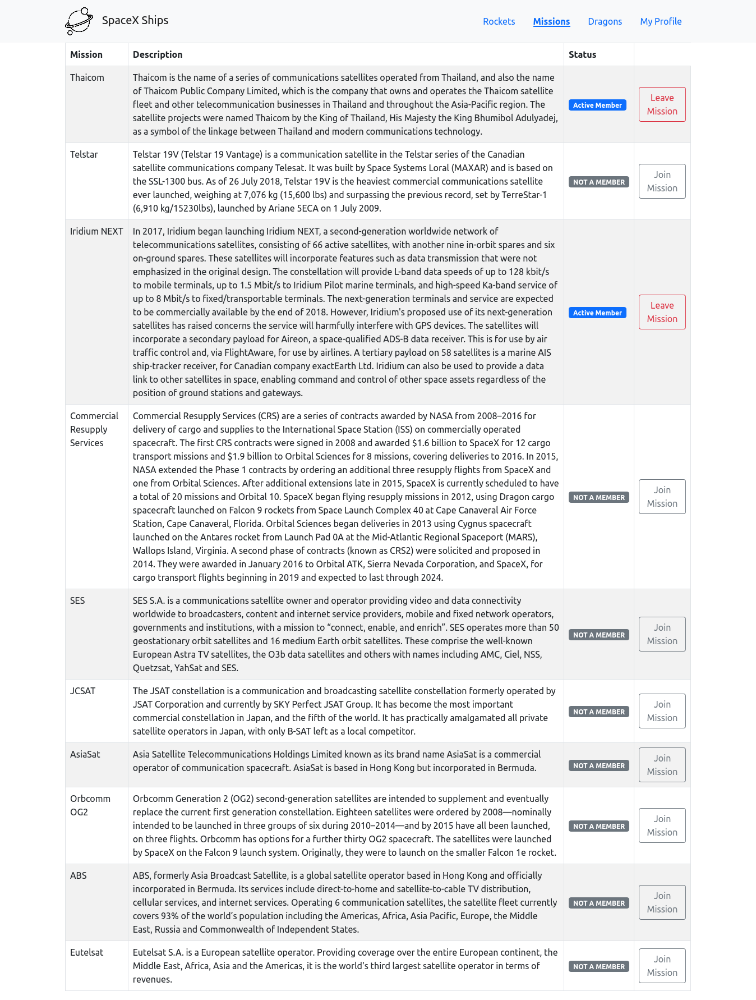
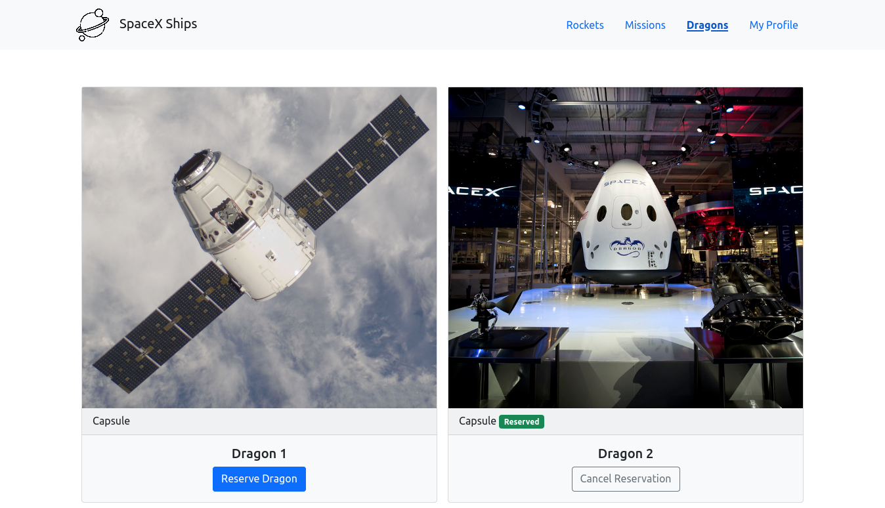
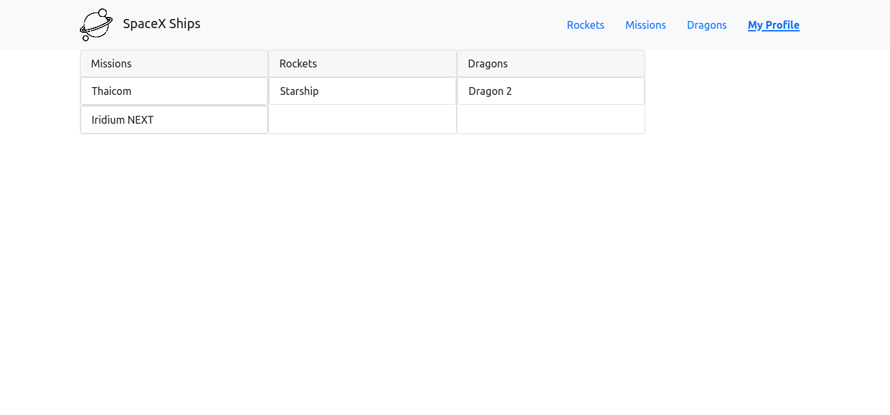

<p align="center">
  <a href="https://www.microverse.org/">
    
  </a>
  <a href="https://github.com/Emmanuelaaron/spaceships">
    
  </a>
  <a href="https://github.com/Emmanuelaaron/spaceships">
    
  </a>
</p>


# Space Ships

## About

In this task, we worked with the real live data from the SpaceX API. Our task was to build a web application for a company that provides commercial and scientific space travel services. The application allows users to book rockets, dragons and join selected space missions.

Below, we showcase screenshots of the app.

<p align="center">
    
</p>
<p align="center">
    
</p>
<p align="center">
    
</p>
<p align="center">
    
</p>

## Built With

- HTML, CSS, JavaScript;
- ReactJS, Redux;
- VisualStudio Code, Git, & GitHub;

## Pre-requisites

- NodeJs (v. 14.17)
- YarnJs (v. 1.22.10)
- Git

## Live Demo

Live demo for this project can be found in this [link](https://spaceships-emma-enio-mario.netlify.app/).

## Getting Started

To run this project, you only need a computer with internet connection and a browser installed, and follow these steps:


1. In your terminal, in the folder of your preference, type the following bash command to clone this repository:

```sh
git clone git@github.com:Emmanuelaaron/spaceships.git
```

2. Now that you have already cloned the repo run the following commands to get the project up and running:
```sh
cd spaceships
yarn
yarn start
```
This should start your local server in [http://localhost:3000/](http://localhost:3000/). To stop it, hit `<CTRL> + C` on your keyboard.
## Run tests

To test the App's components and logic, please, run the following command:

```sh
yarn test --watchAll
```
When the tests are finished, just hit `q` key to leave the watch mode for the tests.

## Author

👤 **Mario Alberto Rodriguez Cota**

- GitHub: [@mariordgez](https://github.com/mariordgez)
- Twitter: [@MarioRo75396624](https://twitter.com/MarioRo75396624)
- LinkedIn: [LinkedIn](https://linkedin.com/in/mario-alberto-rodriguez-cota-a2860a205)


👤 **Ênio Neves de Souza**

- GitHub: [@enionsouza](https://github.com/enionsouza)
- Twitter: [@enionsouza](https://twitter.com/enionsouza)
- LinkedIn: [Enio Neves de Souza](https://www.linkedin.com/in/enio-neves-de-souza/)

👤 **Emmanuel Isabirye**

- Github: [@EmmanuelAaron](https://github.com/Emmanuelaaron)
- Twitter: [@EmmanuelAaron](https://twitter.com/EmmanuelIsabir1)
- LinkedIn: [@EmmanuelAaron](https://www.linkedin.com/in/fullstackwebdev-emma/)

## 🤝 Contributing

Contributions, issues, and feature requests are welcome!

Feel free to check the [issues page](https://github.com/Emmanuelaaron/spaceships/issues).

## Show your support

Give a ⭐️ if you like this project!

## 📝 License

This project is [MIT](./LICENSE) licensed.
